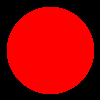

# Haskell Ray Tracer

A ray trace written in Haskell by following along with the [Ray Tracer Challenge](http://raytracerchallenge.com/)

## Examples

### Projectile
Testing out the canvas code from Chapter 2

### Clock
Testing out the matrix transformation code in Chapter 4

### Simple Sphere
Rendering our first image of a sphere in Chapter 5

### Shaded Sphere
Adding some shading in Chapter 6

